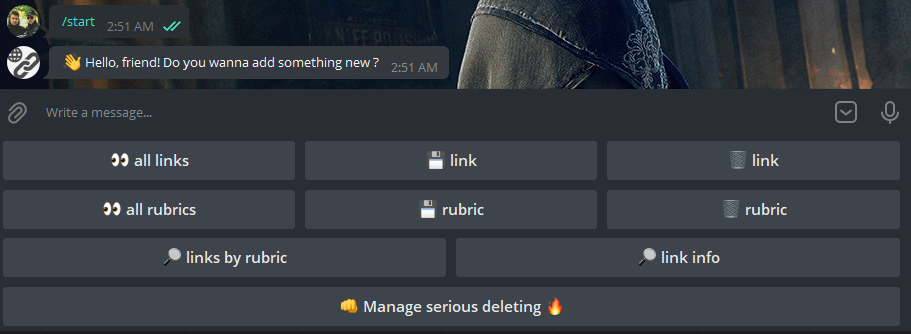
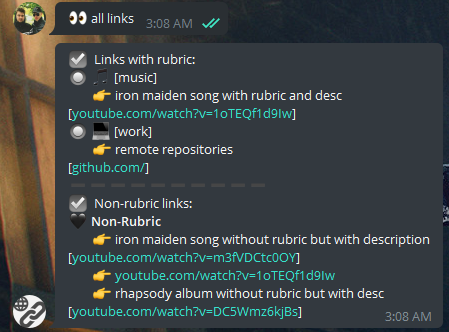

# It is The Telegram Note Bot!

### Note Bot

It's your small links saver (and notes also - up to you) helper!

### Easily you can:

→ save links;  
→ create rubrics;  
→ get sorted report;  
→ and do all these with a simple interface.

 

## Try to use :)

<b>@links_saver_bot</b>

## Some examples

